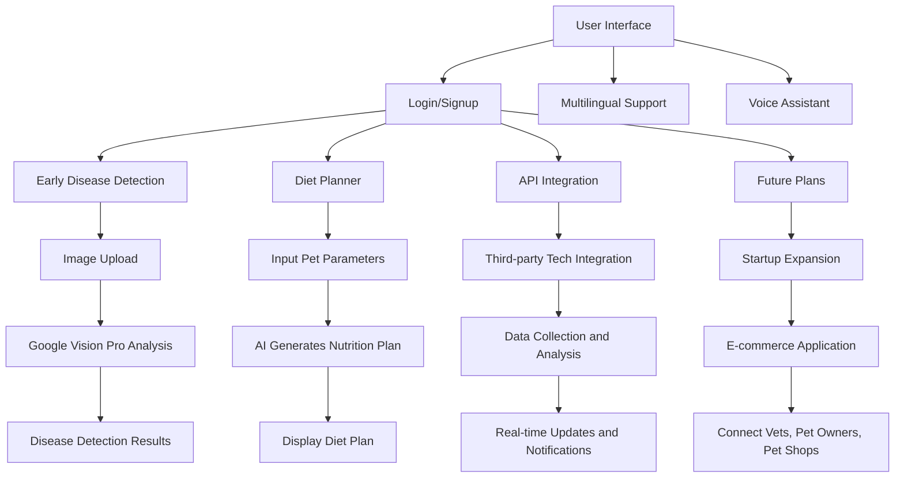

```mermaid
graph TD
    A[User Interface] --> B[Login/Signup]
    A --> C[Multilingual Support]
    A --> D[Voice Assistant]
    B --> E[Early Disease Detection]
    E --> F[Image Upload]
    F --> G[Google Vision Pro Analysis]
    G --> H[Disease Detection Results]
    B --> I[Diet Planner]
    I --> J[Input Pet Parameters]
    J --> K[AI Generates Nutrition Plan]
    K --> L[Display Diet Plan]
    B --> M[API Integration]
    M --> N[Third-party Tech Integration]
    N --> O[Data Collection and Analysis]
    O --> P[Real-time Updates and Notifications]
    B --> Q[Future Plans]
    Q --> R[Startup Expansion]
    R --> S[E-commerce Application]
    S --> T[Connect Vets, Pet Owners, Pet Shops]
```
